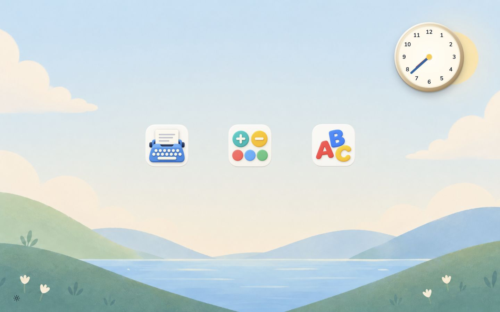
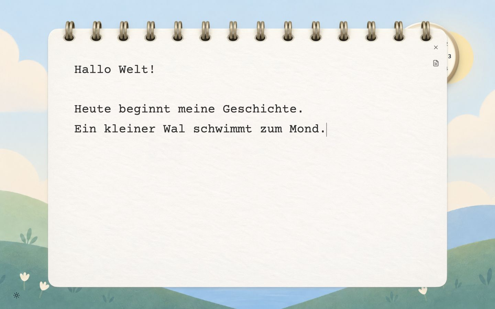
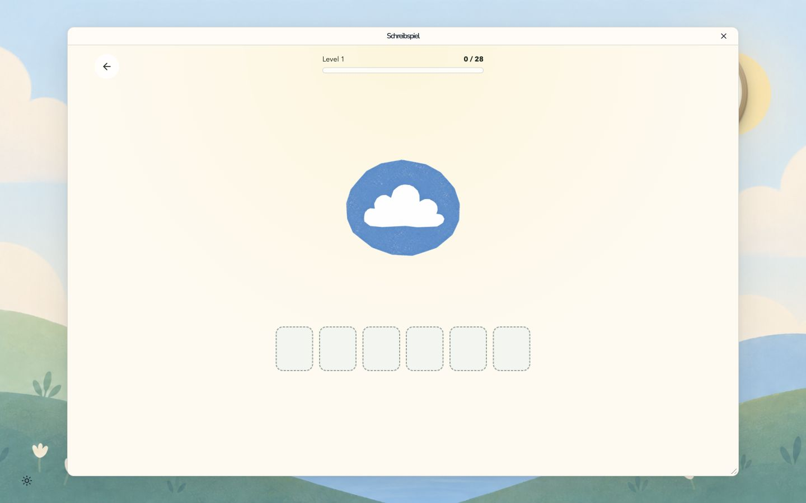
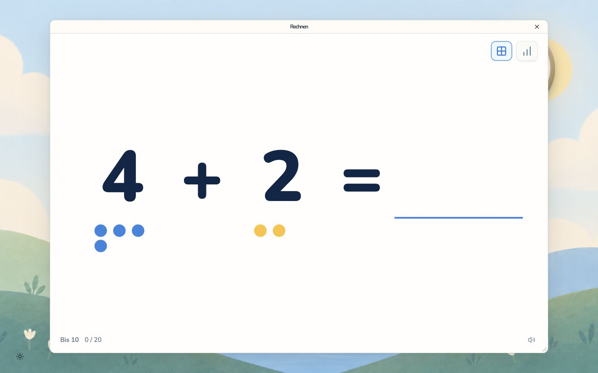
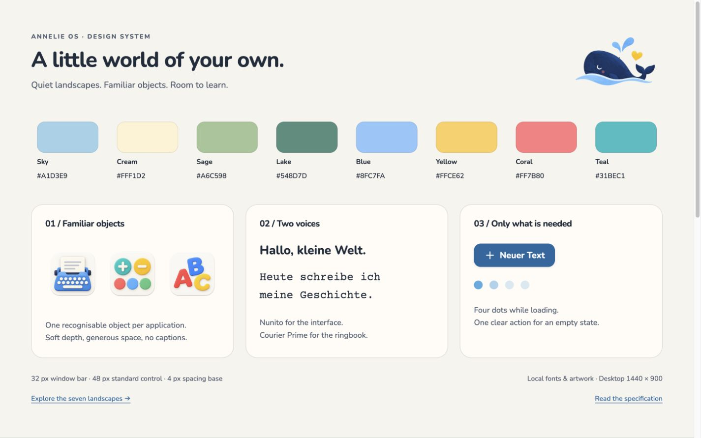
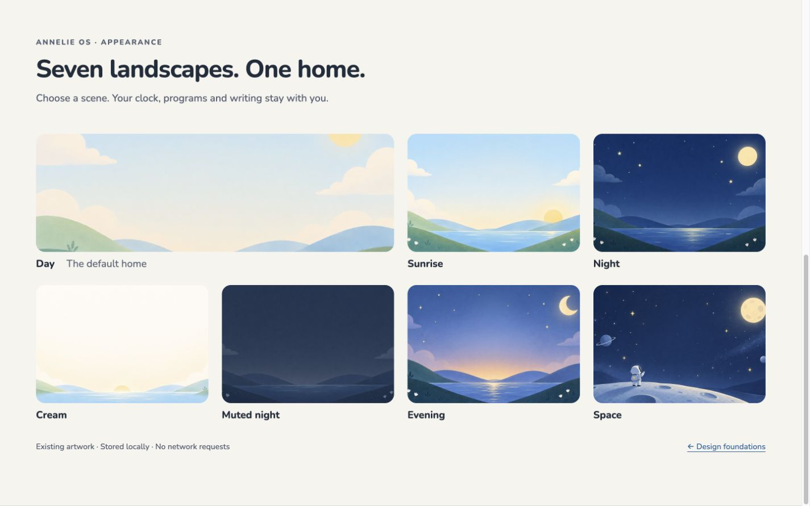

# Annelie OS

**A quiet little desktop for writing, counting and discovering letters.**

Annelie OS turns an older MacBook Air into a familiar place to learn: an
illustrated landscape, three tactile program icons and a real working notebook.
Built with **Svelte 5 + SvelteKit**, running locally in the existing Ubuntu Chrome
kiosk. German interface, local assets, independent applications.



[Design system](docs/design/README.md) · [Screenshot gallery](docs/screenshots/README.md) ·
[App contract](docs/app-contract.md) · [Install on Ubuntu](https://github.com/dweigend/annelies_computer/blob/main/docs/annelie-os-installation.md)

## A personal project, with room to grow 🐳

Right now, this is a very personal project: I'm building it for Annelie's
computer, around the things she enjoys and the way she uses it. Some choices
are specific to her MacBook Air, and that's where this little adventure starts.

I plan to keep working on it, add new programs and features, and gradually make
it more general so it can run on other devices too. There's plenty left to explore!

Fancy forking it and building your own version? Please do — I'd love to see what
you make. Give it your own personality and make it a home for someone else's ideas.

## A desktop made of familiar things

- **Move the clock and icons.** Drag them anywhere within the desktop; positions
  survive reloads. Both use the same placement and persistence implementation.
- **Open, move, resize, close.** Games run inside a slim shell-owned window.
  The X always returns home, including while an application is loading.
- **Choose a landscape.** Seven backgrounds, from daylight to outer space,
  are bundled locally. No extra splash screen interrupts kiosk startup.
- **Write on paper.** The editor is a frameless ringbook with typewriter text,
  one document control and automatic saving. Drag its binding to move it.

## Texten — a floating ringbook



Start on a blank page. Previous texts live behind the small document icon;
the first line becomes the document name. The editor saves locally, retains a
last-good copy and keeps a browser draft until the server acknowledges the edit.
Conflicting edits preserve both versions. There is no permanent toolbar, separate
title field or rich-text formatting.

## Three applications, one home

| Texten | Schreibspiel | Rechnen |
| --- | --- | --- |
| Built into this repository | [Letter-Lerner](https://github.com/dweigend/letter-lerner) | [Arithmetic Trainer](https://github.com/dweigend/arithmetic-trainer)¹ |
| Plain-text writing and recovery | Writing, puzzle and reading practice | Addition, subtraction, points and number-line aids |
| Shell process | Independent process on port 3001 | Independent process on port 3002 |

| Schreibspiel | Rechnen |
| --- | --- |
|  |  |

Each learning app keeps its own repository, server and persistent data. Annelie OS
loads it in an iframe and owns the surrounding window. A small manifest, health
endpoint and validated ready message make the applications feel like one system.
Closing a window leaves its server running. An unavailable game cannot block writing.

¹ Arithmetic Trainer is currently a private repository; access is required.

## The visual system

The surfacing whale is the official identity. Illustrated lakes and hills give
the desktop its atmosphere; warm surfaces, clear controls and local typography
keep the working areas calm. The ring binding is the editor's decorative exception.





The [visual boards](docs/design/overview.html) render the actual local assets and
shared tokens. [src/app.css](src/app.css) is the canonical stylesheet;
[design/tokens.json](design/tokens.json) exports the design contract. Nunito is
used for the interface and Courier Prime for writing. Source artwork, font
licenses and provenance are documented in [assets](docs/design/assets.md).

To view the boards locally:

```sh
python3 -m http.server 4174 --bind 127.0.0.1
# Open http://127.0.0.1:4174/docs/design/overview.html
```

The earlier [interactive catalogue](docs/design/catalogue.html) remains a historical
design reference. The running application is authoritative for current behavior.

## Run locally

Requires Bun 1.3.14 and Node 24 LTS. Dependencies are pinned in the lockfile.

```sh
bun install --frozen-lockfile
bun run dev
# Open http://127.0.0.1:3000
```

For a production build:

```sh
bun run build
bun run start
```

Writing works without either game. To run all three applications, start each game
separately and set its `ANNELIE_OS_ORIGIN` to `http://127.0.0.1:3000`. Letter-Lerner
also uses `LETTER_LERNER_KIOSK=1` and `OPENAI_AI_DISABLED=true`; follow its repository's
catalogue and asset setup. Point the shell's `ANNELIE_OS_APPS_FILE` to a JSON array
using the [example registry](docs/apps.example.json). Without that setting, only
Letter-Lerner is registered by default.

## Install on the MacBook Air

The [device repository](https://github.com/dweigend/annelies_computer) owns Ubuntu
services, offline packaging, Chrome policies, SSH administration and rollback.
The installed shell uses `http://127.0.0.1:8765/`; learning apps use ports 3001 and
3002. Application data lives outside replaceable release directories.

On **2026-09-07**, SSH confirmed these installed revisions and active services:

| Application | Installed revision |
| --- | --- |
| Annelie OS | `8271e56340c2` |
| Letter-Lerner | `6d426e5e088e` |
| Rechnen | `777d0be85f1b` |

Use the [shell installation guide](https://github.com/dweigend/annelies_computer/blob/main/docs/annelie-os-installation.md)
and [arithmetic installation guide](https://github.com/dweigend/annelies_computer/blob/main/docs/arithmetic-installation.md).
A Git push does not deploy to Ubuntu. Root-owned installation changes require
administrator authentication; the existing boot sequence and parent unlock remain.

## Architecture

| Location | Responsibility |
| --- | --- |
| `src/lib/components` | Clock, notebook, application window and controls |
| `src/lib/client` | Shared desktop movement, window geometry, autosave and recovery |
| `src/lib/server` | Atomic document persistence and validated app registry |
| `src/lib/shared` | Shared types and validation rules |
| `src/routes/api` | Document and application endpoints |
| `src/app.css` | Product tokens, components and documentation-board styles |
| `static/design` | Local artwork, icons and licensed fonts |
| `docs/design` | Specification, visual boards and historical references |
| `tests` | Persistence, recovery, concurrent updates and registry boundaries |

SvelteKit's Node adapter produces the server. Native textarea, dialog and pointer
events keep dependencies small. There is no cloud account, plugin SDK or vendored
game source. The target is the MacBook Air at **1440 × 900**, with keyboard and
trackpad; mobile is outside the product scope.

## Data and configuration

| Variable | Purpose |
| --- | --- |
| `ANNELIE_OS_DATA_DIR` | Document root; defaults to `$XDG_DATA_HOME/annelie-os` or `~/.local/share/annelie-os` |
| `ANNELIE_OS_APPS_FILE` | Path to the independent app manifest array |
| `HOST`, `PORT`, `ORIGIN` | Production listener and stable application origin |

Documents are UUID-named JSON files with revisions and `.bak` recovery copies.
Writes are serialized per document, synced and atomically replaced. Run one server
per data directory. Preserve both server data and the browser profile in backups:
learning progress, desktop placement and pending drafts can be browser-owned.
A last-good copy is recovery support, not protection against disk failure.

## Checks and packaging

```sh
bun run lint
bun run check
bun run test
bun run check:design
bun run build
bash scripts/package-release.sh
```

Commit tracked changes before packaging. The archive contains the production
output and startup script; the device repository supplies the Linux runtime,
services and installation procedure. See the [release report](docs/release-report.md)
for detailed verification and historical deployment notes.

Screenshots above were captured on 2026-09-07 from local production builds at
1440 × 900 using demonstration text and isolated app data. They are real UI
captures, not proposed mockups or photographs of the MacBook.
