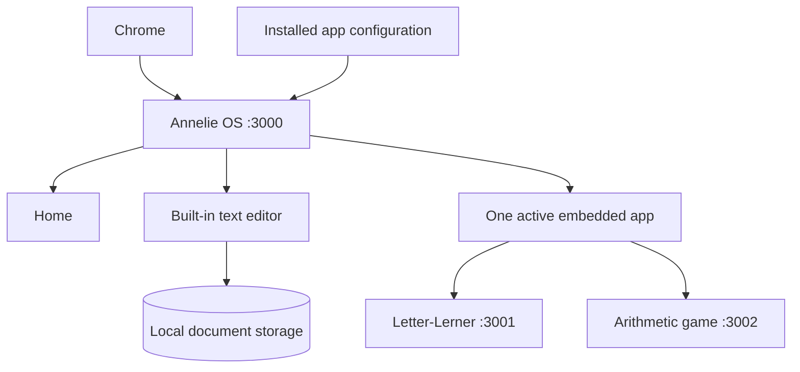

# Annelie OS implementation plan

Date: 2026-09-06. Status: visual direction consolidated in the v1 design system;
application implementation and editor scope confirmation remain next.

## Outcome

Deliver a locally runnable Annelie OS shell and a complete simple text editor.
A child can open a program, write and recover saved texts, and return home
through one coherent interface. Learning games run independently and can be
installed, updated and restarted without rebuilding the shell.

This is an application layer intended for Chrome on an existing Ubuntu kiosk,
not a new operating-system distribution. Local development comes first.

## Confirmed requirements and proposed defaults

Confirmed: public Annelie OS repository; collaborative GPT Image exploration;
an implementation plan and agent brief; shell and text editor together;
Letter-Lerner and arithmetic game in separate repositories and local servers;
a visually unified experience. Existing handover also requires future kiosk
autostart, prevention of desktop escape, and continued SSH administration.

Proposed defaults, adjustable during design discussion: plain text with titles,
multiple documents, autosave, undo/redo, a recoverable trash, local server-side
storage, one active game at a time, and a persistent home control. No cloud,
sign-in, live model calls, rich-text formatting, printing, import or export in
the first editor version. These are scope proposals, not previously approved
requirements. Age and final editor scope remain open. The visual reference family
is now supplied by David; the v1 system specifies 36 px Courier Prime writing as the baseline.

## Repository boundaries

| Repository | Responsibility |
| --- | --- |
| `dweigend/annelie-os` | Home, persistent shell, editor, app registry, integration contract, local startup |
| `dweigend/letter-lerner` | Existing literacy game, own build, data, release and embedded-mode support |
| Future arithmetic repository | Arithmetic rules, game UI, own build, data and release; name not yet chosen |
| `dweigend/annelies_computer` | Ubuntu services, kiosk session, browser policy, device installation and rollback |

Only `annelie-os` is being created in this preparation step. The arithmetic
game is a future independent project; its rules are not part of this agent's
implementation scope.

## Runtime design

Proposed stable production origins:

| Component | Address | Process |
| --- | --- | --- |
| Shell and editor | `http://127.0.0.1:3000` | Annelie OS server |
| Letter-Lerner | `http://127.0.0.1:3001` | Independent game server |
| Arithmetic game | `http://127.0.0.1:3002` | Independent game server |

Ports are configuration defaults; detect collisions, fail clearly and keep
origins stable after deployment. Do not alternate `localhost` and `127.0.0.1`
because browser storage belongs to an origin.

Use a borderless cross-origin iframe below the persistent shell as the initial
integration choice. Each game owns its page and assets; the shell owns home
navigation and loading/error states. Test this choice with the actual game
before investing in the full shell. Different ports retain separate origins.
The shell cannot style or inspect a cross-origin game DOM, so embedded mode
and shared visual tokens must be implemented explicitly in each game.
See [MDN iframe](https://developer.mozilla.org/en-US/docs/Web/HTML/Reference/Elements/iframe).

Avoid a reverse proxy, runtime source imports, microfrontend framework and
plugin SDK unless the integration spike produces a concrete need. A small
versioned manifest and optional messages are enough for the first release.
See [the app contract](app-contract.md).

## Stack and local startup

Use SvelteKit 2, Svelte 5, TypeScript, Bun for dependency management/scripts,
Biome for linting, and bits-ui/shadcn-svelte where useful. Keep styling in one
`src/app.css`; use Lucide icons and locally available fonts/assets.

Use the documented Node adapter with a supported pinned Node runtime for the
production server. Set `HOST`, `PORT` and `ORIGIN` explicitly. Do not use Vite
preview or a development server as the installed kiosk runtime. Verify Bun
runtime compatibility separately if choosing it instead of Node.
Reference: [SvelteKit Node adapter](https://svelte.dev/docs/kit/adapter-node).

Add repeatable commands for install, development, lint, type checking, behavior
tests, build and production start. Document how to start the shell and each
available sibling app in separate terminals. Do not make the shell build
depend on a sibling checkout. Use a clearly labeled test fixture for a missing
arithmetic app only in development and tests.

## Existing Letter-Lerner evidence

Inspected `main` at `2f81836f39c78952b7785a8ad23ef632593d0b11` on 2026-09-06
through GitHub: `package.json`, `svelte.config.js`, `src/hooks.server.ts`,
`src/lib/server/runtime-data.server.ts`, `src/app.css`, and README.

- SvelteKit 2 / Svelte 5, Vite, Bun lockfile, Biome, Vitest and bits-ui exist.
- It uses `adapter-auto`; a supported standalone production adapter/startup
  must be established in that repository before Ubuntu installation.
- The word catalogue supports `LETTER_LERNER_DATA_DIR`; the inspected code also
  accesses images under `static` relative to its working directory. Package
  required assets and set the working directory deliberately.
- The README describes browser-local learning progress and local audio for
  child practice. Keep the browser profile and origins stable; separately test
  embedded storage, audio activation and offline behavior.
- The admin route checks loopback client addresses. That restriction does not
  distinguish a child from an adult on the same kiosk. Embedded child mode and
  later kiosk policies need an explicit adult-access boundary.
- Existing base tokens include cream `#fffaf0`, ink `#253126`, green `#2f9b4d`
  and rounded system typography. These inform compatibility, not a final shell
  design decision.

No embedded protocol or production health endpoint was verified. Reinspect the
current game revision and actual response headers before integration work.

## Editor behavior and persistence

Proposed first version:

1. Create a text, edit its title and body, open an existing text, and return home.
2. Use a native textarea for the body, preserving keyboard input, selection,
   undo/redo, umlauts, multiline text and composition. Do not add a rich-text
   editor dependency for plain text.
3. Persist each document as a validated record with UUID, title, body, schema
   version, revision and timestamps in an external configurable data directory.
   Serialize writes per document and use atomic replacement; never derive file
   paths from a title. Keep a last-good backup for recovery.
4. Debounce autosave (proposed 500 ms). Display `Gespeichert` only after the
   server acknowledges persistence. Preserve edits in a browser draft journal
   while writes are pending, and restore or reconcile them after a crash.
5. Flush pending writes on in-app navigation. Do not rely on unload events to
   guarantee saving. Handle write failure, disk-full and conflicting revisions
   visibly without clearing the draft or overwriting newer content.
6. Provide move-to-trash and restore rather than immediate permanent deletion.
   Keep this action secondary so the writing screen stays quiet.

Keep rendering, editor state, autosave coordination and document storage in
separate small modules. Browser drafts are recovery aids; the acknowledged
server copy is the durable document. Define backup/restore procedures and test
updates without placing personal writing in a checkout.

## Delivery sequence

### 1. Select the visual target

Completed design preparation: David supplied eight reference images. The
[v1 design system](design/system.md) consolidates their visual language, local
assets, tokens, component states and app-integration rules. Earlier mockups are
historical. Review the interactive catalogue and reuse the delivered system.
Confirm remaining editor scope proposals before implementing persistence.

### 2. Prove the separate-program integration

Start the real Letter-Lerner and a minimal shell on separate loopback ports.
Verify embedding, child-mode navigation, input focus, local audio, storage,
resize, reload and stopping/restarting the game. Keep home usable after a game
failure. Make only required companion changes in Letter-Lerner, preserving its
standalone mode and documenting them in that repository.

### 3. Build the shell

Implement home and persistent system navigation, native editor route and one
external-app view. Validate app manifests; show unavailable/not-installed
states without displaying URLs or stack traces. An absent game must not prevent
writing. Match the selected mockups at the old MacBook Air design viewport of
1440 x 900. Mobile layouts and mobile checks are outside scope. Use real semantics, visible focus and at least 48 px controls.

### 4. Complete the editor

Follow the latest editor feedback: a blank white page, typewriter text and one
small document icon opening the text list directly. Omit rings, texture, wallpaper
and shadows. Keep document controls inside that temporary panel, with no permanent sidebar,
title field, formatting toolbar or status row. Implement document operations
and persistence without adding resting UI clutter. Verify writing,
switching documents, navigating home, refresh, server restart, browser reopen,
save failures, draft recovery, revision conflicts, trash and restore.

### 5. Package and hand over

Document local setup, builds, program registration, data location, backup and
production startup. Provide the app contract and example configuration for
the arithmetic repository. Review the diff, simplify, run lint/type/build/tests,
visually inspect the actual running UI and commit complete units.

Provide a local preview and explicit verification report. Hand device runtime
requirements to `annelies_computer`; Ubuntu deployment remains a separate
stage. A successful UI preview does not prove kiosk lockdown or boot behavior.

## Acceptance criteria for the local implementation agent

- A fresh checkout can run the documented setup without private credentials.
- Home and editor match the selected visual target and use one design system.
- Real Letter-Lerner runs separately and can be opened and left inside the shell.
- Missing, stopped or failed games do not break the shell or editor.
- A registered test app demonstrates the contract for the future arithmetic app;
  it is never presented as a completed arithmetic game.
- Texts survive navigation, reload, application restart and updating the build;
  failures do not silently lose pending writing.
- All child-facing runtime assets work without internet after installation.
- Keyboard operation, focus, audio activation and embedded storage are tested
  in the intended Chrome environment; record any unavailable target testing.
- Lint, type checks, relevant tests and production build pass.
- Documentation names the tested versions, remaining limitations and exact
  steps for the later Ubuntu deployment task.

## Later device milestone

In the device repository, inspect the live Ubuntu installation, create separate
systemd services, install pinned app releases with data outside release folders,
and verify health before enabling kiosk autostart. Back up target files and
prepare rollback first. Preserve SSH, administrator authentication and Wi-Fi.
Test actual cold boot, escape shortcuts, recovery, persistence and restart
before calling the kiosk complete. No target changes are part of this plan-only
preparation step.
