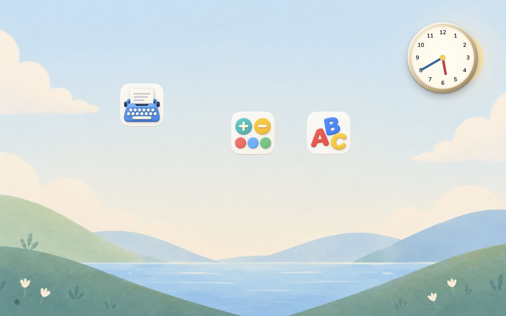
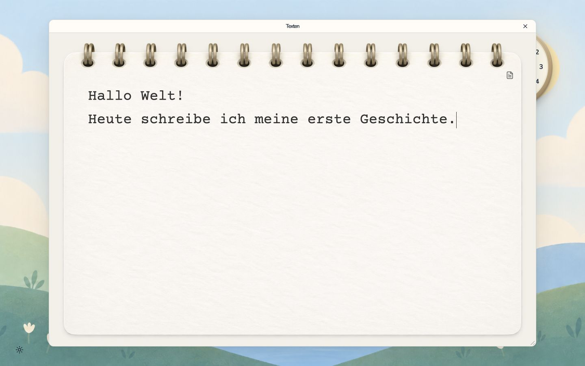

# Annelie OS 1.0 — implementation and handover

Date: 2026-09-06. Status: application release and offline Ubuntu installer built;
not installed on the target MacBook during this task.

## Remote installation update

SSH became available after the MacBook was switched on. The complete bundle is
now extracted at `/home/annelie/annelie-os-1.0.0` on the target; its outer SHA-256
and all internal checksums match. Both packaged production servers were started
successfully on the actual MacBook using the bundled Linux Node 24.20.0 runtime
and separate temporary data directories. Both health endpoints passed, and the
temporary processes were stopped afterward.

The installed browser already includes the earlier password-store startup fix.
The existing kiosk remains active. Permanent service installation is awaiting
interactive administrator authentication; `sudo -n true` requires it. Run from
the administration Mac:

```sh
ssh -t anneli 'sudo bash /home/annelie/annelie-os-1.0.0/install.sh install'
```

The screenshots below show the implemented production UI at 1440 × 900 on the
administration Mac. They are not evidence of completed target installation.





## Framework decision

Svelte 5 and SvelteKit 2 provide the UI and local HTTP routes in one small
application. Adapter-node packages a production Node server. Bun manages
locked dependencies and build/check commands; the MacBook needs only the
bundled Node 24.20.0 LTS runtime. Native HTML controls and the existing central
stylesheet keep this release small. There is no additional component framework
because the required button, textarea and dialog patterns already exist.

## Implemented

- Desktop opens immediately at kiosk launch. No duplicate OS startup screen.
- Three caption-free icons; dragging and Alt+arrow placement persist after reload.
- Seven supplied local wallpapers, minimal chooser and preference persistence.
- Live analog clock with CSS bevel, shadow and dimensional hands.
- One active program window with 32px title bar and an always-reachable X.
- Edge/corner resizing; keyboard-accessible bottom-right resize control.
- Ringbook editor, Courier Prime, an initially blank page and one document icon.
- Multiple texts, first-line document labels, 500ms autosave and native editing.
- Local JSON documents, revision checks, atomic writes, file synchronization,
  last-good backup and retention of damaged originals.
- Immediate browser draft journal; reconnect/reload recovery and preservation of
  both versions when another session changes a document.
- Four-dot loading state and the requested single-button empty/failure states.
- Validated local app registry, bounded health/readiness checks, exact-origin
  ready messages and game frames that cannot replace the top-level kiosk.
- Separate Letter-Lerner production build with embedded navigation, ready signal,
  asset-aware health check, explicit frame-ancestor permission and server-side
  adult-route closure for the installed kiosk mode.
- Offline Linux x64 bundle, service templates, staged startup checks, configuration
  backup and rollback installer in the device repository.

Screenshots: [editor](qa/editor-production.jpg), [desktop](qa/desktop-production.jpg).

## Installation artifact

The administration Mac holds the complete offline bundle at
`../annelies_computer/build/annelie-os-1.0.0-linux-x64.tar.gz` (101 MiB).
Its SHA-256 is
`07fed40dddcee7ae50ac6b574198367aeefb14687930f44bf203fc94c0ff6efb`.
The packaged revisions are Annelie OS `7ca3dd631bae`, Letter-Lerner
`6d426e5e088e`, and device installer `dd8b3a6db543`.
All internal artifact checksums passed after final assembly.

Application source is published on the Annelie OS main branch. The independent
game integration is published as [draft pull request 14](https://github.com/dweigend/letter-lerner/pull/14);
the bundle already contains that integration without requiring a merge.

## Verification evidence

The application passes Biome/Prettier, Svelte/TypeScript checks with no warnings,
15 behavior tests, design-asset/token checks and the production build. The tests
cover durable storage, concurrent updates, lost acknowledgements, backup recovery,
damaged-original preservation, browser draft recovery, edits during pending saves,
conflict preservation and registry boundaries.

Letter-Lerner passes its lint/type checks, 38 existing behavior tests and its
Node production build. Both release archives were extracted outside their source
repositories and started using their packaged files. Shell HTML, local artwork,
font, document API and game health/practice route returned success. A foreign-origin
write request was rejected with 403. No source checkout or dependency install was
needed by either extracted runtime.

Interactive checks used the production servers at 1440 × 900: ringbook rendering,
multiline writing, umlauts, creating a new text, immediate close, persisted text
after reload, icon movement after reload, shrinking the editor window, game entry
and nested navigation, keyboard completion of a word, and restoration of the next
word after closing and reopening the game. Stopping the game server produced only
`Noch einmal` with X retained; restarting it and clicking retry reopened the game.

Installer scripts pass ShellCheck and shell syntax validation. The existing kiosk
Python checks pass (8 checks). The complete bundle verifies its own checksums and
includes the official Linux runtime verified against nodejs.org's published SHA-256.

## Scope and remaining acceptance

The MacBook initially did not answer SSH, then became reachable after power-on.
The bundle and temporary verification files have been transferred; both Linux
servers have passed their health checks on the device. Installed services, Chrome
policies, Wi-Fi and boot configuration have not been changed yet. Permanent
installation, physical audio, parent unlock and reboot remain explicit acceptance
work. Do not describe server health checks or local browser verification as a
completed device installation or security audit.

The arithmetic game is still a separate future project. The release prepares its
window/registry integration but does not include game rules or pretend that a
calculator mockup is a finished learning game. Letter-Lerner retains its own current
artwork and learning mechanics. No rich text, document trash, export, printing or
new parent settings UI was added to the agreed minimal editor.

## Next steps

1. Make the existing MacBook available via `ssh anneli` and transfer the offline
   bundle. Run the documented installer in an interactive terminal with sudo.
2. Restart Chrome after the installation has verified both app servers. The shell
   keeps port 8765 so the existing browser startup script remains unchanged.
3. On the actual MacBook, check writing/reopening, audio, app resizing/closure,
   parent unlock, one planned reboot and renewed SSH access.
4. Back up the document directory and Chrome profile. Record the installed app
   revisions and the installer-provided rollback path.
5. Build the arithmetic game in its own repository, then install its independent
   server and add its validated manifest and Chrome allowlist entry. No shell
   rebuild is required for a compatible `arithmetic` application.

Install/rollback instructions are in
[the device repository](https://github.com/dweigend/annelies_computer/blob/main/docs/annelie-os-installation.md).

## Implementation sources

- [SvelteKit Node adapter](https://svelte.dev/docs/kit/adapter-node)
- [SvelteKit routing and server endpoints](https://svelte.dev/docs/kit/routing)
- [Node release metadata](https://nodejs.org/dist/index.json)
- [Node 24.20.0 checksums](https://nodejs.org/dist/v24.20.0/SHASUMS256.txt)
- [Independent app contract](app-contract.md)
