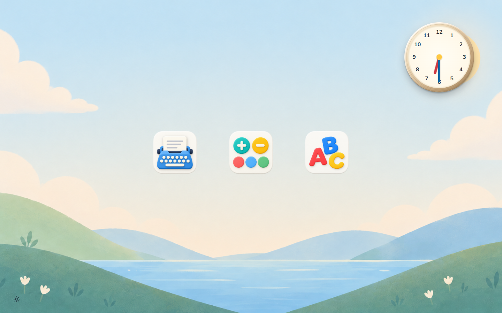
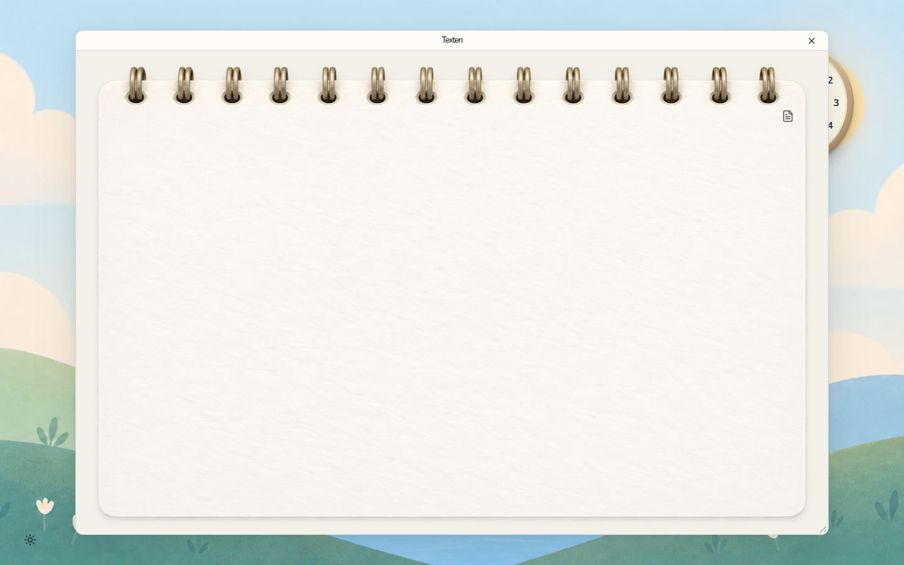
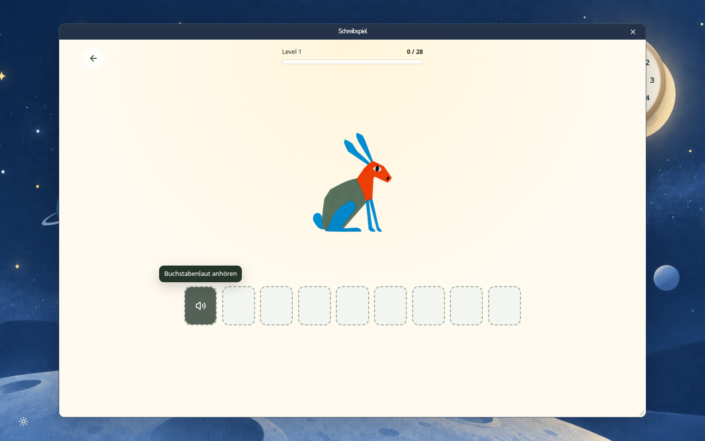

# Annelie OS 1.0 — implementation and handover

Date: 2026-09-06. Status: production applications installed and verified running
on the MacBook Air at 18:23; new desktop and editor visually verified afterward.

## MacBook deployment result

- Annelie OS `7ca3dd631bae` runs on loopback port 8765.
- Independent Letter-Lerner `6d426e5e088e` runs on loopback port 3001.
- Both system services are active and enabled for startup; both health checks pass.
- The initial `annelie-kiosk-web.service` is stopped and disabled.
- The existing kiosk address, boot flow, parent unlock and Chrome profile remain.
- Chrome's allowlist includes both application origins, with audio permitted.
- Installer rollback: `/var/backups/annelie-apps/change-9YM4DiFL`.

Chrome initially continued displaying the old test page after server replacement
and browser restart. Moving its old HTTP, code and service-worker caches out of
the active profile, then restarting Chrome, made the new UI visible. The former
caches are retained in `~/.cache/annelie-deployment/cache-before-release`.
Local storage and IndexedDB were retained. No single cache layer was isolated
as the sole cause.

The following screenshots were captured directly from the actual MacBook display
at 1440 × 900. The editor was opened through its desktop icon.

Letter-Lerner was opened inside its shell window, entered through its menu and
closed with the shell X. Its independent server remained active.

The user requested complete removal of the initial test app. Its service is
already inactive and disabled; its root-owned HTML/CSS and unit still require
removal. The reviewed `scripts/remove_kiosk_placeholder.sh` in the device repo
checks production health, preserves a recovery copy, then removes only those
obsolete files. It preserves the actual kiosk session and unlock components.
The cleanup is now staged at `/home/annelie/remove-kiosk-placeholder.sh`; its
privileged execution remains pending.

## Framework decision

Svelte 5 and SvelteKit 2 provide the UI and local HTTP routes in one small
application. Adapter-node packages a production Node server. Bun manages
locked dependencies and build/check commands; the MacBook needs only the
bundled Node 24.20.0 LTS runtime. Native HTML controls and the existing central
stylesheet keep this release small. There is no additional component framework
because the required button, textarea and dialog patterns already exist.

## Implemented

- Desktop opens immediately at kiosk launch. No duplicate OS startup screen.
- Three caption-free icons; dragging and Alt+arrow placement persist after reload.
- Seven supplied local wallpapers, minimal chooser and preference persistence.
- Live analog clock with CSS bevel, shadow and dimensional hands.
- One active program window with 32px title bar and an always-reachable X.
- Edge/corner resizing; keyboard-accessible bottom-right resize control.
- Ringbook editor, Courier Prime, an initially blank page and one document icon.
- Multiple texts, first-line document labels, 500ms autosave and native editing.
- Local JSON documents, revision checks, atomic writes, file synchronization,
  last-good backup and retention of damaged originals.
- Immediate browser draft journal; reconnect/reload recovery and preservation of
  both versions when another session changes a document.
- Four-dot loading state and the requested single-button empty/failure states.
- Validated local app registry, bounded health/readiness checks, exact-origin
  ready messages and game frames that cannot replace the top-level kiosk.
- Separate Letter-Lerner production build with embedded navigation, ready signal,
  asset-aware health check, explicit frame-ancestor permission and server-side
  adult-route closure for the installed kiosk mode.
- Offline Linux x64 bundle, service templates, staged startup checks, configuration
  backup and rollback installer in the device repository.

Screenshots: [editor](qa/editor-production.jpg), [desktop](qa/desktop-production.jpg).

## Installation artifact

The administration Mac holds the complete offline bundle at
`../annelies_computer/build/annelie-os-1.0.0-linux-x64.tar.gz` (101 MiB).
Its SHA-256 is
`07fed40dddcee7ae50ac6b574198367aeefb14687930f44bf203fc94c0ff6efb`.
The packaged revisions are Annelie OS `7ca3dd631bae`, Letter-Lerner
`6d426e5e088e`, and device installer `dd8b3a6db543`.
All internal artifact checksums passed after final assembly.

Application source is published on the Annelie OS main branch. The independent
game integration is published as [draft pull request 14](https://github.com/dweigend/letter-lerner/pull/14);
the bundle already contains that integration without requiring a merge.

## Verification evidence

The application passes Biome/Prettier, Svelte/TypeScript checks with no warnings,
15 behavior tests, design-asset/token checks and the production build. The tests
cover durable storage, concurrent updates, lost acknowledgements, backup recovery,
damaged-original preservation, browser draft recovery, edits during pending saves,
conflict preservation and registry boundaries.

Letter-Lerner passes its lint/type checks, 38 existing behavior tests and its
Node production build. Both release archives were extracted outside their source
repositories and started using their packaged files. Shell HTML, local artwork,
font, document API and game health/practice route returned success. A foreign-origin
write request was rejected with 403. No source checkout or dependency install was
needed by either extracted runtime.

Interactive checks used the production servers at 1440 × 900: ringbook rendering,
multiline writing, umlauts, creating a new text, immediate close, persisted text
after reload, icon movement after reload, shrinking the editor window, game entry
and nested navigation, keyboard completion of a word, and restoration of the next
word after closing and reopening the game. Stopping the game server produced only
`Noch einmal` with X retained; restarting it and clicking retry reopened the game.

Installer scripts pass ShellCheck and shell syntax validation. The existing kiosk
Python checks pass (8 checks). The complete bundle verifies its own checksums and
includes the official Linux runtime verified against nodejs.org's published SHA-256.

## Scope and remaining acceptance

Installation and production service startup are verified on the target. The new
desktop and editor are visually verified there. A full reboot after application
installation, physical audio, a complete play-through and renewed parent-unlock acceptance
remain unverified. The SSH connection subsequently timed out again. Do not
interpret enabled services as a completed cold-boot test.

The arithmetic game is still a separate future project. The release prepares its
window/registry integration but does not include game rules or pretend that a
calculator mockup is a finished learning game. Letter-Lerner retains its own current
artwork and learning mechanics. No rich text, document trash, export, printing or
new parent settings UI was added to the agreed minimal editor.

## Next steps

1. Keep the MacBook powered on, open and connected; run the prepared cleanup for
   the root-owned initial test website and verify its files/unit are absent.
2. Check Letter-Lerner interaction/audio, writing/reopening and parent unlock on
   the actual MacBook.
3. Perform one planned reboot and confirm automatic startup and renewed SSH access.
4. Back up the document directory and Chrome profile. Keep the recorded application
   rollback path; if restoring the former test website, restore its cleanup backup
   before using the original installer rollback.
5. Build the arithmetic game in its own repository, then install its independent
   server and add its validated manifest and Chrome allowlist entry. No shell
   rebuild is required for a compatible `arithmetic` application.

Install/rollback instructions are in
[the device repository](https://github.com/dweigend/annelies_computer/blob/main/docs/annelie-os-installation.md).

## Implementation sources

- [SvelteKit Node adapter](https://svelte.dev/docs/kit/adapter-node)
- [SvelteKit routing and server endpoints](https://svelte.dev/docs/kit/routing)
- [Node release metadata](https://nodejs.org/dist/index.json)
- [Node 24.20.0 checksums](https://nodejs.org/dist/v24.20.0/SHASUMS256.txt)
- [Independent app contract](app-contract.md)
